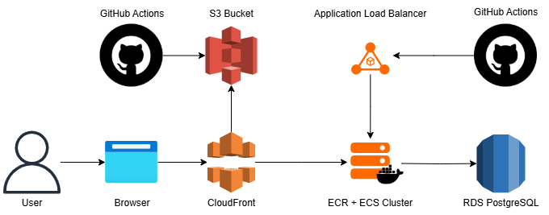

# Backend do Sistema de Gerenciamento de Clientes

Este repositório contém o backend do sistema de gerenciamento de clientes desenvolvido com NestJS. A aplicação oferece endpoints para cadastro, listagem, atualização, exclusão e visualização dos clientes. A seguir, você encontrará informações sobre como configurar, executar e implantar a aplicação.

## Tecnologias Utilizadas

- **NestJS** – Framework Node.js para construir aplicações escaláveis e eficientes.
- **PostgreSQL** – Banco de dados relacional utilizado para armazenamento dos dados.
- **AWS ECS & ECR** – Containerização e orquestração na AWS.
- **AWS RDS** – Serviço gerenciado de banco de dados.
- **AWS Load Balancer** – Distribuição de carga e gerenciamento de tráfego.
- **GitHub Actions** – Pipeline de CI/CD para deploy automático.

## Arquitetura do Sistema

Abaixo, segue uma visão geral da arquitetura do sistema:



## Pré-requisitos

Para executar o projeto localmente, você precisa ter instalado:

- Node.js (versão 22 ou superior)
- npm
- Docker (opcional, para simular ambiente de containerização)

## Configuração de Variáveis de Ambiente

Antes de rodar a aplicação localmente, configure as seguintes variáveis de ambiente:

- `DB_HOST` – Endpoint do Database PostgreSQL
- `DB_PORT` – Porta do PostgreSQL
- `DB_USER` – Usuário do banco de dados
- `DB_PASSWORD` – Senha do banco de dados
- `DB_NAME` – Nome do banco de dados

Você pode criar um arquivo **`.env`** na raiz do projeto com o seguinte conteúdo de exemplo:

```
DB_HOST=seu-endpoint-do-db
DB_PORT=5432
DB_USER=seu-usuario
DB_PASSWORD=sua-senha
DB_NAME=nome-do-db
```

Essas variáveis e segredos estão salvos na definição da tarefa do ECS.

# Instalação
## Clone o repositório:

```
git clone https://seu-repositorio.git
cd nome-do-repositorio
Instale as dependências:
```

```
npm install
```

Com as variáveis de ambiente configuradas, inicie a aplicação:

```
npm run start:dev
```

A aplicação ficará disponível no endereço configurado (por padrão, http://localhost:3000).

## Deploy
O deploy deste projeto é automatizado através do **GitHub Actions**. Sempre que houver um push para a branch principal (ou outra branch configurada), o pipeline realizará as seguintes etapas:

**Build:** Compilação.
**Testes (Não implementados):** Execução dos testes automatizados.
**Containerização:** Construção da imagem Docker e envio para o AWS ECR.
**Deploy:** Atualização dos serviços no AWS ECS com a nova imagem, utilizando o AWS Load Balancer para rotear o tráfego.


## Hospedagem na AWS
**AWS ECS & ECR:** A aplicação é executada em containers orquestrados pelo AWS ECS. As imagens Docker são armazenadas no AWS ECR.
**AWS RDS:** O banco de dados PostgreSQL é gerenciado pelo AWS RDS, garantindo alta disponibilidade e escalabilidade.
**Load Balancer:** O tráfego é distribuído por meio de um Load Balancer, garantindo performance e balanceamento de carga adequado.


## Desenvolvimento de painel administrativo
Tomando como base os 3 dias que precisei para desenvolver o projeto, podemos fazer as seguintes estimativas para o desenvolvimento do painel administrativo:

**Tempo de Desenvolvimento:**
Se formos considerar a mesma complexidade, levaríamos em torno de 3 dias para ser concluído, assumindo que a estrutura e as integrações com o backend já estejam bem definidas. Caso o painel exija mais funcionalidades ou uma interface mais elaborada, o tempo pode variar entre 3 a 5 dias.

**Quantidade de Desenvolvedores:**
Uma equipe enxuta de 1 a 2 desenvolvedores é suficiente. Por exemplo, um desenvolvedor sênior (ou tech lead) pode coordenar a arquitetura e as decisões críticas, enquanto um desenvolvedor pleno (ou até um júnior com supervisão) pode focar na implementação dos componentes da interface e na integração com a API.

**Senioridade dos Desenvolvedores:**
Idealmente, a equipe seria composta por:

- **1 Desenvolvedor Sênior:** Responsável pela definição da arquitetura, padrões de código, integração com o backend e resolução de pontos críticos.
- **1 Desenvolvedor Pleno (ou Júnior com supervisão):** Atuando na implementação da interface, consumo dos serviços e desenvolvimento de funcionalidades menos complexas.